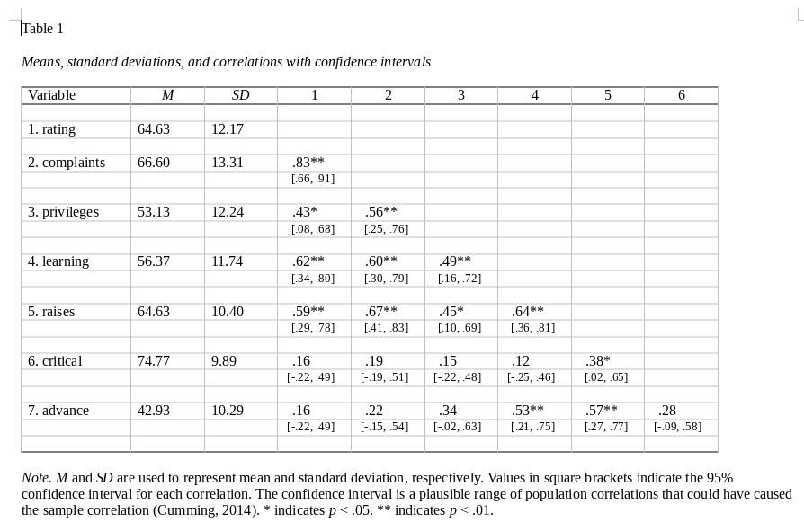

## What is apaTables and how does it help me and the scientific community?

It's an R package that turns analysis results obtained in GNU R (e.g., a linear model) into tables which you can directly include into your publication. The tables are written to files in Microsoft Word *doc* format and follow [APA style](http://www.apastyle.org/products/asc-landing-page.aspx). And the package obtains all of the statistics needed for an APA Style table, i.e., it performs additional computations if needed (often standardization, confidence intervals).

* less fiddling around in MS Word
* beautiful tables
* no more errors while transferring results from your statistics software to your word processor: reproducible research

From the apaTables vignette:

    "For example, in psychology Nuijten et al. (2015) found that in 50% of articles there was at least one instance of a reported test statistic (e.g., t(24)=22.71) being inconsistent with the reported p-value. This inconsistency rate suggests there is a major problem with reproducibility in the psychological literature."

## Supported table types

The list of supported tables includes:

* Correlation tables using the function **apa.cor.table**
* Regression tables using **apa.reg.table**:
  * Basic regression table (with confidence intervals)
  * Blocks regression table (model comparison)
* ANOVA
  * 1-way ANOVA and d-value tables (**apa.aov.table**, **apa.1way.table**, **apa.d.table**)
  * N-way ANOVA (**apa.2way.table**)
  * Repeated measures ANOVA (via *ez* package function **ezANOVA** and **apa.ezANOVA.table**)

## Example: Create a correlation table

### The attitude data set

From a survey of the clerical employees of a large financial organization, the data are aggregated from the questionnaires of the approximately 35 employees for each of 30 (randomly selected) departments. The numbers give the percent proportion of favourable responses to seven questions in each department.

The data frame has 30 observations (one per department) and 7 variables (the percentage of positive responses to the 7 questions). The first is an overall rating of the department, the other 6 are questions on specific aspects:

* rating: overall rating
* complaints: Handling of employee complaints
* privileges:	Does not allow special privileges
* learning: Opportunity to learn
* raises: Raises based on performance
* critical: Too critical
* advancel: Advancement

This dataset comes with the *apaTables* package, so you need to load the package to have it available. To get an overview:

    install.packages("apaTables")
    library("apaTables")
    head(attitude)

Let us see how the ratings of the 6 questions correlates with the overall rating for the department and create an APA-style table.

### Creating the table

    library(apaTables)
    apa.cor.table(attitude, filename="Table1_APA.doc", table.number=1)

This should give you a table that looks like this:

**Note**: The output *doc* file is saved in the current working directory. You can find the working directory by typing `getwd()` and change it with `setwd("/some/path/")`.
