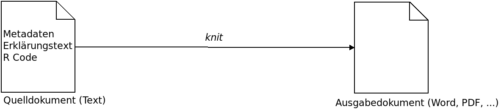

## Was ist *RMarkdown* und was bringt es mir?

Ein RMarkdown (Rmd) Dokument ermöglicht es, wissenschaftliche Berechnungen und deren Ergebnisse und Interpretation gemeinsam zu speichern und professionell zu präsentieren.

Dies ermöglicht:

* Reproduzierbarkeit: Bei geänderten Daten kann die Analyse inklusive Abbildungen einfach reproduziert werden
* Teilen: Das Ausgabedokument kann verschickt werden, und KollegInnen, die die Daten nicht haben, können dennoch die Methoden nachvollziehen und die Ergebnisplots sehen

## Wie funktioniert es?

Technisch gesehen ist ein Rmd Dokument eine normale Textdatei, die drei Dinge enthält:

* Metadaten (im YAML-Format)
* R-Code (oder Code in anderen Sprachen)
* Erklärungen in Text-Form

Die Textdatei ist ein **Quelldokument** und kann durch sogenanntes *knitten* ausgewertet und in das **Ausgabedokument** transformiert werden. Dabei wird z.B. der enthaltene R-Code ausgeführt, Plots werden erstellt und als Bilder gespeichert, die Steuerbefehle im Text (z.B. Formeln wie $F(x) = \int^a_b \frac{1}{3}x^3$ oder Steuerzeichen wie \* für *kursiv* oder \*\* für **fett**) werden interpretiert, und danach wird aus allen erstellten Komponenten das Ausgabedokument erstellt:




## Wie sieht die Quelldatei aus?

Wie ein normales R-Skript mit zusätzlichen Blöcken. Schauen wir auf ein Beispiel-Dokument. Es beginnt mit Meta-Daten:

    ---
    title: "R Markdown Einführung"
    author: "Tim Schäfer"
    date: "2019-05-28"
    output: html_document
    ---

    Dann irgendwelcher freier Text zur Erklärung, eventuell *kursiv* oder gar **fett** gesetzt. Dann kann mal R Code folgen.


Zu beachten im freien Text sind besonders die Steuerzeichen (z.B. die \* bei \*kursiv\*). Sie sind der eigentliche Markdown-Code. Eine Liste aller üblichen Steuerzeichen ist im unten verlinken Markdown Cheat Sheet zu finden.

**Hinweis**: Soll ein Steuerzeichen ohne seine Sonderfunktion verwendet werden, muss es *escaped* werden. Das Escape-Zeichen ist der Backslash: die Eingabe von \\\* im Markdown-Code führt also zu \* im Ausgabedokument.


#### WICHTIG!

**Um zu sehen, wie man R-Code einfügt, sehen wir uns nun parallel zu diesem Ausgabedokument auch das Quelldokument an. Dazu öffnen wir die Datei `rmarkdown_intro.Rmd` in rstudio oder in einem beliebigen Texteditor[^1], falls nicht bereits geschehen. Alternativ [hier klicken für eine Online-Ansicht des Codes](https://github.com/dfsp-spirit/reproducible_science/blob/master/rmarkdown_intro/rmarkdown_intro.Rmd).**


## Installation

    install.packages("rmarkdown")
    

## Starten wir mit einem Beispiel (im Code)

Der folgende Block besteht aus R-Code. Dieser wird beim *Knitten* ausgeführt...

```{r}
fit = lm(dist ~ speed, data = cars)
b = coef(fit)
plot(cars)
abline(fit)
```

...und der resultierende Plot wird im Dokument eingebettet. In folgendem Code kann man auf die Variablen natürlich weiterhin zu greifen. Daher kann ich hier verraten:

Die Steigung der Regressionsgeraden in der obigen Abbildung beträgt `r b[1]`.

## Integration in rstudio

RMarkdown ist exzellent in [rstudio](https://rstudio.com/) integriert. So kann man neue Rmd-Dokumente in der grafischen Oberfläche erzeugen, unterschiedliche Code-Blöcke einfügen, und einzelne Blöcke oder das gesamte Dokument knitten und das Ergebnis live ansehen (sogennantes *Notebook-Interface*, vgl. Jupyter-Notebook für Python oder Matlab *Live Scripts*.).

Man kann die Rmd-Textdateien aber natürlich auch mit jedem anderen Texteditor erstellen. Auch das *Knitten* ist auf der Kommandozeile möglich:

`R -e rmarkdown::render"('rmarkdown_intro.Rmd', output_file='markdown_intro.html')"`


## Welche Ausgabeformate gibt es?

Sehr viele, denn unter der Haube wird [Pandoc](https://pandoc.org/) benutzt. Die gebräuchlichsten sind wohl PDF, HTML, und Word. Es gibt aber sehr viele Möglichkeiten, und wenn man sich mehr damit beschäftigt, kann man z.B. Literaturdatenbanken ansprechen, Präsentationsfolien erzeugen lassen, oder ganze Bücher oder wissenschaftliche Artikel über LaTeX setzen lassen.

Das Ausgabeformat wird in den Metadaten festgelegt, für HTML z.B. sieht das so aus:

`output: html_document`

## Grenzen von RMarkdown


* Oft ist eine Vorverarbeitung oder Zwischenschritte mit anderer Software nötig und man hat eine Sammlung von Skripten, die in der richtigen Reihenfolge und evtl. mit manuellen Zwischenschritten ausgeführt werden müssen. Diese Gesamtpipeline sollte daher gut dokumentiert sein, und in den Skripten sollte ersichtlich sein, von welchen Eingabedaten (und eventuell bereits erfolgten Vorverarbeitungsschritten) das Skript ausgeht.
* Die ausgegebenen Dokumente sehen schon sehr gut aus, aber wenn man sie noch weiter im Stil anpassen möchte (oder muss) sind eventuell erweiterte Kenntnisse nötig und es kann schnell technisch werden.

## Nützliche Ressourcen

* Die offizielle Hilfe unter [rmarkdown.rstudio.com/](https://rmarkdown.rstudio.com/)
* [Das R Markdown Cheat Sheet](https://github.com/rstudio/cheatsheets/raw/master/rmarkdown-2.0.pdf)

### Credits

Die Beispiele in diesem Dokument entstammen der offiziellen Hilfe zu RMarkdown. An diese ist auch der Rest des Dokuments angelehnt.

[^1]: Es lohnt sich meiner Meinung nach, nicht den Standardtexteditor des Betriebssystems zu nutzen, sondern lieber einen Editor zu installieren, der Syntax Highlighting kann und mit unterschiedlichen Encodings und Zeilenende-Zeichen klarkommt (z.B. [Atom](https://atom.io/)).
