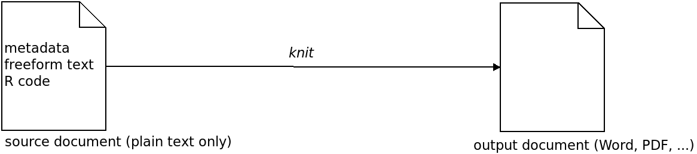

## What is *RMarkdown* and how can it help me?

An R Markdown (Rmd) document contains visualizations of statistical results along with the source code used to create them.

This enables:

* Dcoumented and reproducible workflow: When the data changes, all you have to do is re-run the file to get the new results and figures.
* Sharing: One can send the output document to colleagues, who can use it to see the results AND understand the methods.

(If they want to run the analysis, they also need the data of course, but they do not have to do that.)

## How does it work?

Technically an Rmd document is a simple text file containing sections. Each section is can be one of the following 3 types:

* document metadata (in YAML-Format), like author information and desired output format.
* R source code (or code in some other supported languages)
* comments and explanations written in plain text

The Rmd file is a **source document** that needs to be transformed (*knitted*) to produce the **output document**. During the knitting, the contained
R source code is executed, plots and figures are produced and saved as images, control sequences in the text (e.g., equations like $F(x) = \int^a_b \frac{1}{3}x^3$ or control sequences like \* for *italics* or \*\* for **bold face**) are interpreted, and everything is embedded into the output document:




## What does an Rmd file look like?

Like a normal R script, but with additional blocks or sections. Here is an example document starting with a metadata section:

    ---
    title: "R Markdown Introduction"
    author: "Tim Schäfer"
    date: "2021-08-23"
    output: html_document
    ---

This can be followed by some text, maybe *in italics* or **bold**. Then some R code.


There are some easy control characters which can be found in the Markdown Cheat Sheet linked below.

**Note**: To use a control character without its special meaning, one has to escape it. The escape character is backslash, so entering \\\* in your markdown code produces \* in the output document.


#### IMPORTANT for the following examples

**To understand how to insert R code, you should now open this Rmd file (`rmarkdown_intro.Rmd`) in rstudio or any text editor[^1], or [click here to see the source online](https://github.com/dfsp-spirit/reproducible_science/blob/master/rmarkdown_intro_en/rmarkdown_intro.Rmd).**


## Installation

    install.packages("rmarkdown")
    

## An Example

The following block consists of R code that will be run when we knit the document:


```{r}
fit = lm(dist ~ speed, data = cars)
b = coef(fit)
plot(cars)
abline(fit)
```

The resulting plot will be embedded into the output document. One can re-use the variables in following code sections, of course. Therefore I can tell you here that:

The slope of the regression line in the plot above is `r b[1]`.

## Integration in rstudio

RMarkdown works especially well with [rstudio](https://rstudio.com/). It is very easy to create Markdown document, add different blocks, knit a single block, several blocks, or the whole document, and view the resulting output (so-called *Notebook-Interface*, similar to Jupyter-Notebook for Python or the Matlab *Live Scripts*.).

Alternatively, it is of course possible to produce the Rmd documents with any text editor. The knitting can also be accomplished on the command line:

`R -e rmarkdown::render"('rmarkdown_intro.Rmd', output_file='markdown_intro.html')"`


## What output formats are available?

A lot, under the hood [Pandoc](https://pandoc.org/) is used to generate output. The most common ones are PDF, HTML, and MS Word. But there are more options, and special packages exist to produce slides for presentations, whole books or scientific journal articles in LaTeX.

The desired output format is specified in a document metadata block and looks like this:

`output: html_document`

## Limitations of Markdown

* Sometimes you need to pre-process data in other software (like FreeSurfer for neuroimaging data) or convert it before you load it into R. This means that you will have a collection
of different scripts which need to be run in the correct order. One should document in a central README file what needs to be done, and what input the Markdown document expects.
* The produced output documents looks pretty decent by default. However, if one wants to further adapt the style of the output documents, it gets rather technical.

## Ressources

* The official documentation at [rmarkdown.rstudio.com/](https://rmarkdown.rstudio.com/)
* [The R Markdown Cheat Sheet](https://github.com/rstudio/cheatsheets/raw/master/rmarkdown-2.0.pdf)

### Credits

The examples used in this document were adapted from the official documentation.

[^1]: Use a good one with line numbers and syntax highlighting for Markdown, like [Atom](https://atom.io/).
´
